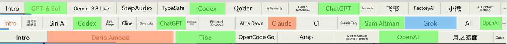
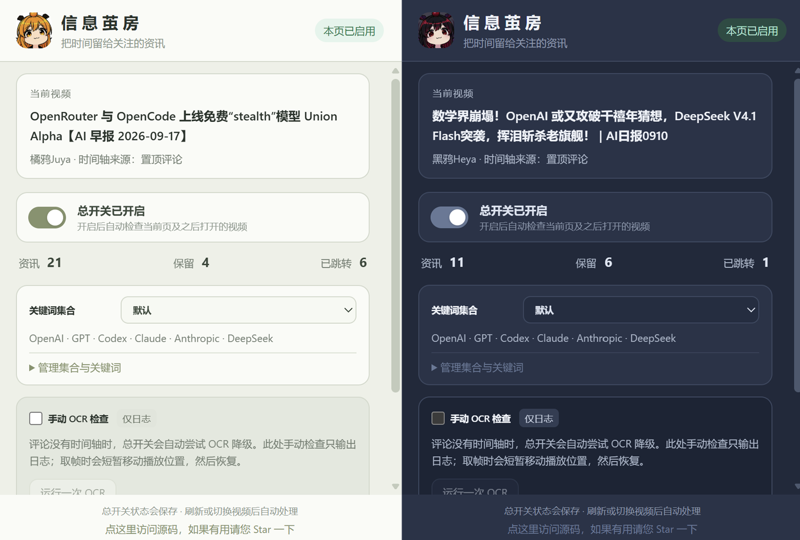

# 信 息 茧 房 （核 弹 提 纯）


   

## 我 已 急 哭。

信息茧房是一个面向 **橘鸦Juya** 与 **黑鸦Heya** 的B站AI早报&晚报制作的安全 **Edge/Chrome 扩展**。

它不会把你的任何B站数据上传到服务器，也不会收集你的账号信息。

## 能做什么？

**把你认为不感兴趣的早报&晚报内容全自动跳过！** 我要是只想看OpenAI，Anthropic和xAI，那为什么我要在和我无关的内容上花时间？



在扩展的UI界面输入你希望看到的信息的关键词，信息茧房帮你**自动筛选和切分**早报视频里你想看的部分，直接把不想看的内容全部跳过。

它会：

- **读时间轴**：优先取置顶评论；作者把索引写在置顶下的回复里，或者正文与回复各写一半，也能读取并合并。
- **没有评论索引时尝试 OCR**：从视频底部章节条切片、识别标题，再按当前关键词集合判断。只有命中关注关键词的片段会保留；必要时整页停止跳段。黑鸦的深色条带会先转换为适合 OCR 的深字浅底图像，不过这一部分可能速度要慢一点。
- **自动跳段**：默认关注 `OpenAI`、`GPT`、`Codex`、`Claude`、`Anthropic`、`DeepSeek`。你可根据自己的兴趣去新建、命名、编辑关键词集合；弹窗显示来源、保留数、跳转次数与日志。
- **一个总开关管后续视频**：刷新、打开新视频或站内切换时自动检查，关闭则停止跳段。旁边的“手动 OCR 检查”只输出日志，不替换当前跳段结果。

## 如何开始？

### 1. 下载项目

在 GitHub 仓库页面点击绿色的 **Code** 按钮，选择 **Download ZIP**，下载后解压。

熟悉 Git 的用户也可以运行：

```powershell
git clone https://github.com/fumingyang2004/information-cocoon.git
```

### 2. 加载扩展

1. Edge 用户打开 `edge://extensions`；Chrome 用户打开 `chrome://extensions`。
2. 打开页面上的 **开发人员模式**。
3. 点击 **加载解压缩的扩展**。
4. 选择**解压后**的 `information-cocoon` 文件夹。

### 3. 开始

1. 点击工具栏上的扩展图标，选择关键词集合，打开**总开关**。
2. 打开橘鸦Juya或黑鸦Heya的一期 B站AI早报&晚报，让视频开始播放。
3. 等待插件自动下滑加载置顶评论区的播放索引，你也可以自己下滑到他们的置顶评论区。成功时，插件右上角会显示绿色的**本页已启用**。
4. 也支持Chrome浏览器。插件安装方法一致。



## 看不到跳段？

1. 弹窗日志会显示时间轴来源、解析结果和实际 `SEEK` 行为。评论可能懒加载；若一直显示“检查中”，等评论区加载后刷新页面。没有可用索引、OCR 边界不一致、识别失败或一个关注词都没找到时，扩展不会盲跳。OCR 会短暂移动播放位置取帧，然后恢复。

2. OCR 英文标题支持大小写不敏感、相邻词拼接，以及长度至少五字符的单字符模糊匹配，例如 `OpenAl` → `OpenAI`。未命中当前关键词集合的片段都会跳过，不再因低置信度、空白或文字太短而保留。首次 OCR 需要联网加载 Tesseract.js 和英文模型。

3. 如果有难以解决的问题，可把日志输出告知我。

## 开发与验证

项目由绝望的只剩下7%周额度的Astra大人开发。完全免费且开源。

扩展是 Manifest V3，代码直接位于仓库根目录。`creator-config.js` 维护受支持的 UP 主和视觉配置；`background.js` 与 `autostart.js` 管总开关和页面切换；`juya-demo.js` 读取时间轴并控制播放器；`page-bridge.js` 将状态和日志送到弹窗。

```powershell
node --test ../information-cocoon-tests/*.test.cjs
```

本地测试材料位于仓库同级的 `information-cocoon-tests/`，不属于扩展运行本体，也不会随本仓库上传。现有测试覆盖评论主路径、作者回复、OCR 错字与关键词跳段、关键词集合和模拟播放器 seek。

**自动 OCR 降级仍然在测试预览中，不能保证百分百可用和稳定性**。

扩展权限限于脚本注入、本地设置、标签页/站内导航检测以及 `www.bilibili.com`。没有账号后台服务；设置保存在扩展本地存储，页面日志留在当前页面。OCR 所需脚本和模型会从 CDN 下载。

## 开源协议

本项目以 [MIT License](LICENSE) 开源。


